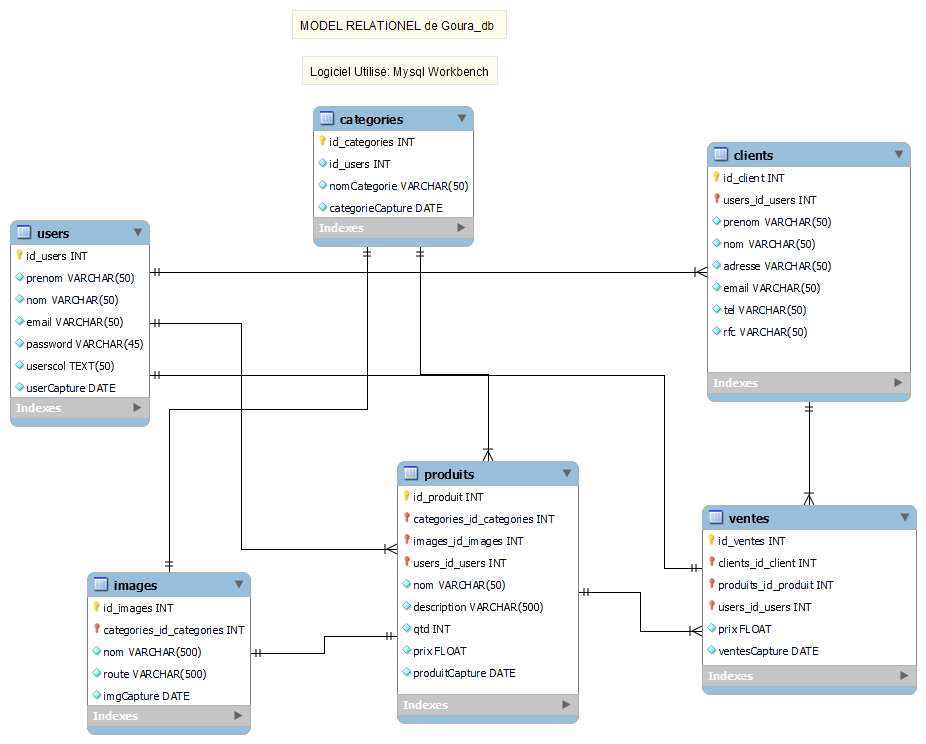
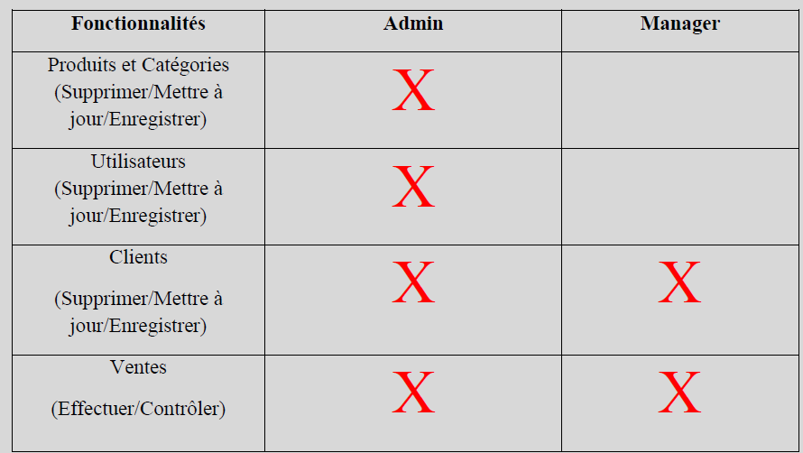

# Goura_Magasin
## Système de Gestion de Stock & Ventes
### Description:
Ce système a été réalisé sur la base de PHP, Javascript, MySQL et CSS.
J'ai opté pour l'utilisation de PHP orienté objet, de cette façon, chaque table qui compose la base de données possède une classe PHP, ce qui facilite les appels de méthodes et l'organisation du code.
Organisation du dossier GOURA MAGASIN:

[1. Base de données : il contient les requêtes et de données pour exécuter.]

[x] [2. Classes : Il contient toutes les classes de chaque module avec les respectives méthodes.]

[x] [3. CSS : Il contient les styles de page.]

[x] [4. Images : Il contient toutes les images que nous avons besoin pour le site.]

[x] [5. Files : Il contient toutes les images de produits.]

[x] [6. JS : Il contient toutes les scripts javascript pour chaque module pour exécuter les fonctions de CRUD (Create, Read, Update, Delete).]

[x] [7. Lib : Il contient les libraires pour la création de PDF, jQuery, Alertify, Bootstrap et select 2.]

[x] [8. Process : Il contient les archives pour faire la liaison entre les classes et affichages.]

[x] [9. Affichages : Il contient tous les affichages des modules.]

### Schéma Base de données (MySQL):

### Scripts Utilisés:
- Asynchronous Javascript et XML (Ajax) :
J'ai choisi d'utiliser Ajax pour pouvoir accélérer les réponses des pages Web en échangeant de petites quantités d'informations avec le serveur Web en coulisse. En outre, cela évite de devoir recharger l'ensemble de la page web chaque fois qu'une nouvelle information doit être consultée sur le serveur.

- JavaScript Object Notation (JSON) :
J'ai utilisé JSON pour effectuer des requêtes Ajax dans lesquelles j'ai effectué différentes interactions avec la base de données (dans mon cas MySQL), pour effectuer des opérations telles que l'interrogation, l'inclusion et la suppression dans la base de données.

- AlertifyJS :
Affiche un message dans le navigateur via une boîte de dialogue, qui n'est rien d'autre qu'une petite fenêtre popup. En plus du texte, un bouton de confirmation est également affiché pour indiquer que la personne a effectivement lu le message. Par conséquent, la fenêtre ne se fermera pas tant que le bouton de confirmation n'aura pas été cliqué.

- Select2 :
Select2 offre une boîte de sélection personnalisable qui prend en charge la recherche, le balisage, les ensembles de données distants, le défilement infini et de nombreuses autres options très utilisées.

- Bootstrap :
pour le style des pages (CSS).

- DomPDF :
D'une manière générale, le DOM PDF est une classe PHP capable de convertir un document HTML en un fichier PDF.

### Barre de navigation, nous avons :
- Page d'accueil
- Gestion des produits (catégories et produits)
- Gestion des utilisateurs
- Gestion des clients
- Vente

## Pour un premier enregistrement:
- User: admin & mdp: admin12345

### Le système comporte différents accès et fonctionnalités:

### À propos de l'hébergement :
Notre site web est hébergé par la plateforme Heroku et après l'hébergement le script pour enregistrer le client, générer des tickets et des rapports PDF a cessé de fonctionner (je essaye de le résoudre, en recréant l'accès à distance par la plateforme et cela donne la même chose, mais dans le serveur local les scripts fonctionnent).

[Lien pour y'acceder](https://goura-magasin-9669892ff581.herokuapp.com)

## Points à amelliorer:
- Ne posséde pas de barre de recherche.
- Ne posséde pas de panier où l’utilisateur ajoute lui-même ses produits.
- En tant qu’Admin ou gestionnaire lorsqu’on ajoute un produit dans le panier il s’ajoute un par un même si c’est le même produit.
- Ne posséde pas d’une page spécial pour chaque produit
